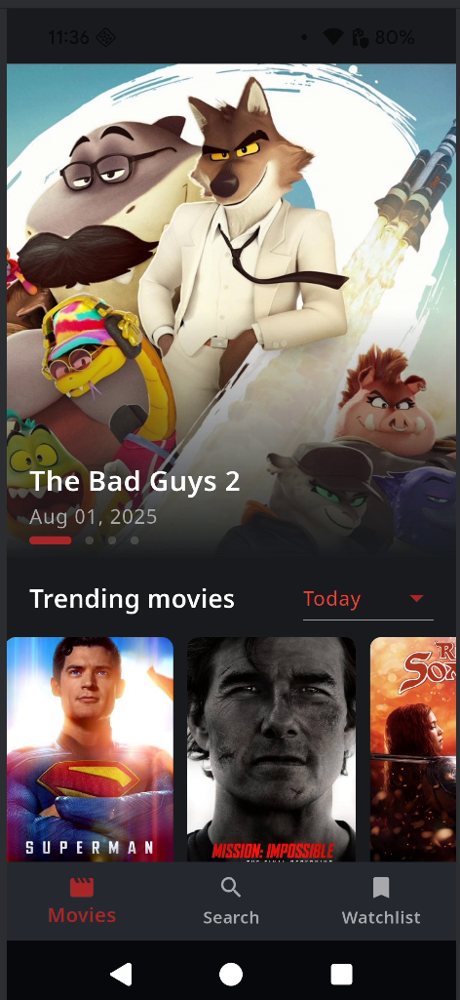
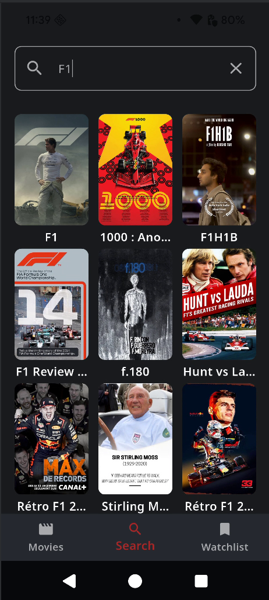
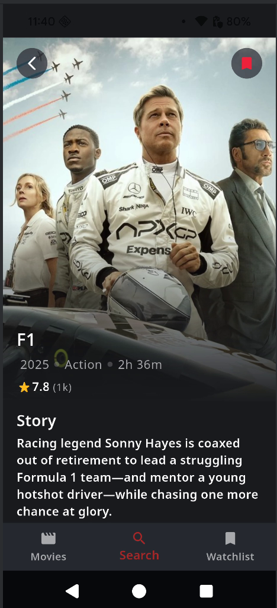
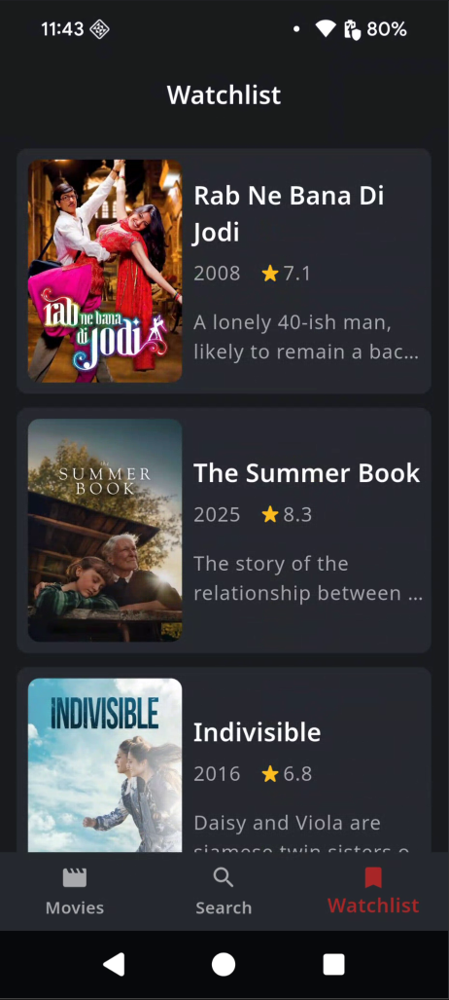

# 🎬 Movie Stack

[](https://flutter.dev/)
[](https://www.android.com/)
[](https://developer.apple.com/ios/)
[](https://pub.dev/packages/hive)
[](#)

A modern, fast, and robust Flutter mobile app to showcase trending movies. Designed with **offline-first functionality**, ensuring a smooth experience even without an internet connection.

## 📸 Screenshots

<p align="center">
  
  
  
  
  
</p>

---

## 📚 Table of Contents

- [✨ Features](#-features)
- [⚙️ Architecture](#️-architecture)
- [🚀 Getting Started](#-getting-started)
- [📱 Build & Release](#-build--release)
- [🤝 Contributing](#-contributing)
- [📝 License](#-license)

---

## ✨ Features

- 🔥 **Trending Movies**  
  Browse the most popular movies trending by day or week.

- 📶 **Offline-First**  
  View popular and top-rated movies even without an internet connection, thanks to a robust offline-first caching strategy.

- 📋 **Comprehensive Movie Details**  
  Get in-depth information on any movie, including cast, reviews, plot summaries, user ratings, and similar films.

- 💾 **Local Storage**  
  All movie data is stored locally using [Hive](https://pub.dev/packages/hive), a lightweight and fast NoSQL database, ensuring a smooth user experience.

- 📱 **Responsive UI**  
  A beautiful, intuitive interface that adapts smoothly to both iOS and Android devices.

- 🧩 **Modular Code**  
  Organized codebase with clear separation into layers for better readability and long-term maintainability.

---

## ⚙️ Architecture

This project follows the principles of **Clean Architecture**, enabling testability, modularity, and separation of concerns.

- 🎨 **Presentation Layer**  
  Contains UI components and manages state using the **BLoC (Business Logic Component)** pattern. Handles user input and displays data.

- 🧠 **Domain Layer**  
  Includes core business logic, entities, and use cases. This layer is framework-agnostic and defines interfaces for data access.

- 📦 **Data Layer**  
  Manages all external data sources like REST APIs and local databases.  
  - Utilizes **Hive** for offline caching.  
  - Implements repositories and data sources.

---

## 🚀 Getting Started

Follow these steps to set up and run the project locally.

### Prerequisites

* **Flutter SDK**: [Install Flutter](https://flutter.dev/docs/get-started/install)
* **IDE**: Visual Studio Code or Android Studio with Flutter & Dart plugins

---

### Installation

Clone the repository:

```bash
git clone https://github.com/curioushead/Movie-Stack.git
cd movie_stack
```

Install dependencies:

```bash
flutter pub get
```

Run code generation for Hive adapters:

```bash
flutter pub run build_runner build --delete-conflicting-outputs
```

Run the application:

```bash
flutter run
```

---

## 📱 Build & Release

### Android

* Build debug APK:

```bash
flutter build apk --debug
```

* Build release APK:

```bash
flutter build apk --release
```

* Build Android App Bundle (AAB) for Play Store:

```bash
flutter build appbundle --release
```

Output location: `build/app/outputs/flutter-apk/` or `build/app/outputs/bundle/release/`

---

### iOS

**Prerequisites:** macOS, Xcode, Apple Developer account

1. Open iOS project in Xcode:

```bash
open ios/Runner.xcworkspace
```

2. Select your device or simulator.
3. For release build: **Product > Archive**, then export IPA via Organizer.

Command-line alternative:

```bash
flutter build ios --release
```

IPA location: `build/ios/iphoneos/Runner.app`

---

## 🤝 Contributing

Contributions are welcome! Open an issue or submit a pull request for bug fixes or new features.
Feel free to open issues for bug reports, feature requests, or suggestions.

---

## 📝 License

This project is licensed under the **MIT License**.
